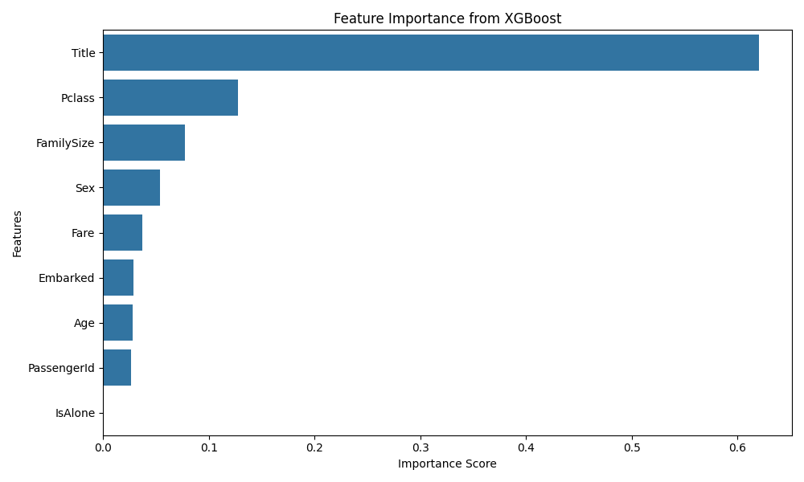
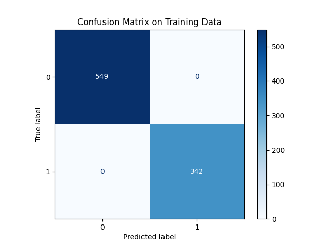

# Titanic Survival Prediction - Stacking Ensemble

This project builds a stacking ensemble model combining Random Forest and XGBoost classifiers with logistic regression as the meta-learner to predict Titanic survivors.

---

## Project Overview

- Dataset: Titanic - Machine Learning from Disaster (Kaggle)
- Features: Engineered from original data - including Title extraction, FamilySize, IsAlone, and encoding categorical variables.
- Models: Random Forest, XGBoost, stacked with Logistic Regression
- Evaluation: 5-fold stratified cross-validation accuracy (~83.5%)
- Deliverable: `submission.csv` for Kaggle submission

---

## Visualizations

### Feature Importance  
Shows the most influential features according to the XGBoost model used in stacking.



### Confusion Matrix  
Confusion matrix on training data for the combined stacking model.



---

## How to Run

1. Clone the repository.
2. Install dependencies:
```
pip install -r requirements.txt
```
3. Run the notebook `Titanic_Stacking_Ensemble.ipynb`.
4. The submission file `submission.csv` will be created in the working directory.

---

Feel free to open issues or submit pull requests for improvements!
